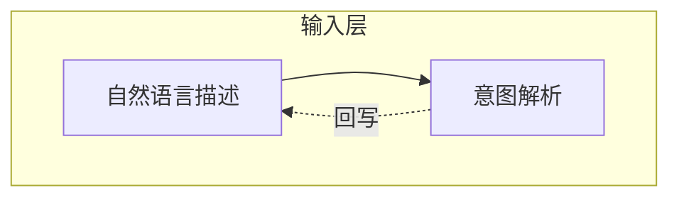

# 贡献指南

感谢你对 CodeGraph 的关注！本项目欢迎社区贡献**图形组件**、**主题样式**和 **DSL 示例模板**。

## 快速上手

```bash
git clone https://github.com/panda-lsy/CodeGraph.git
cd CodeGraph
python -m http.server 8000   # 或 npx serve .
# 浏览器打开 http://localhost:8000/demo/
```

## 贡献类型

| 类型 | 说明 | 目录 |
|------|------|------|
| 🧩 图形组件 | 新增矢量形状/图标（如数据库、云、化学仪器等） | `src/components.js`、`src/components-contrib/` |
| 🎨 主题样式 | 新增配色方案（含日间/夜间双套） | `src/render.js` 的 `THEMES` 对象 |
| 📐 DSL 示例 | 教学模板、架构图、流程图示例 | `examples/`（新建） |

---

## 🧩 贡献图形组件

### 组件规范

一个组件 = 一个纯函数：

```js
(w, h, text, theme) => SVG 内部字符串
```

| 参数 | 类型 | 说明 |
|------|------|------|
| `w`, `h` | number | 节点宽高（像素） |
| `text` | string | 节点文本（可能含 Markdown/TeX） |
| `theme` | object | 当前主题 token，含 `fill`/`stroke`/`textColor`/`fontSize`/`fontFamily`/`rx`/`strokeWidth`/`edgeColor` 等 |

**返回值**：SVG 内部元素字符串（不含外层 `<g>`，由系统自动包裹 `translate`）。

### 示例：自定义"星形"组件

```js
star: (w, h, text, t) => {
  const cx = w / 2, cy = h / 2;
  const r = Math.min(w, h) / 2;
  const innerR = r * 0.4;
  const pts = [];
  for (let i = 0; i < 10; i++) {
    const a = (Math.PI / 5) * i - Math.PI / 2;
    const radius = i % 2 === 0 ? r : innerR;
    pts.push(`${cx + radius * Math.cos(a)},${cy + radius * Math.sin(a)}`);
  }
  return `<polygon points="${pts.join(' ')}" fill="${t.fill}" stroke="${t.stroke}" stroke-width="${t.strokeWidth}"/>
  ${textEl(w, h, text, t)}`;
}
```

### 规范要点

1. **不硬编码颜色**：使用 `theme.fill`/`theme.stroke` 等 token，确保主题切换生效
2. **文本渲染用 `textEl()`**：支持 Markdown/TeX，不要手写 `<text>` 标签
3. **组件名唯一**：建议 `前缀_名称`（如 `chem_beaker`）避免冲突
4. **注册元数据**：在 `META` 中登记 `label`/`category`/`description`

### 内置分类参考

| 分类 | category 值 | 现有组件 |
|------|------------|----------|
| 基础形状 | `basic` | rect / rounded / circle / diamond / hexagon / parallelogram / trapezoid / triangle |
| IT 类 | `it` | cylinder / cloud / server / document |
| 化学类 | `chemistry` | beaker / flask / testtube / condenser / funnel / molecule |
| 标注 | `note` | note |

### 提交流程

1. 复制 `src/components-contrib/template.js` 为 `src/components-contrib/<你的组件>.js`
2. 实现组件函数并导出
3. 在 `demo/index.html` 中 import 并调用 `registerComponents()`
4. 提交 PR，勾选 PR 模板中的"图形组件"自检清单

---

## 🎨 贡献主题样式

### 主题规范

每个主题含 `light` + `dark` 双套，需包含完整 token：

```js
YourTheme: {
  light: {
    fill: '#afe0ff',        // 节点填充色
    stroke: '#3b82f6',      // 节点描边色
    textColor: '#0f172a',   // 文字颜色
    fontSize: 14,           // 字号
    fontFamily: 'serif',    // 字体
    rx: 12,                 // 圆角半径
    strokeWidth: 1.5,       // 描边宽度
    edgeColor: '#475569',   // 连线颜色
    bg: '#ffffff',          // 画布背景
    groupStroke: '#3b82f6'  // 分组框颜色
  },
  dark: { /* 同结构，夜间配色 */ }
}
```

### Token 说明

| Token | 作用 | 建议取值范围 |
|-------|------|-------------|
| `fill` | 节点填充 | 浅色系，与 stroke 同色相 |
| `stroke` | 节点描边 | fill 的加深版 |
| `textColor` | 文字 | 与 fill 高对比 |
| `rx` | 圆角 | 0（方正）~ 16（圆润） |
| `strokeWidth` | 描边粗细 | 1 ~ 2.5 |
| `edgeColor` | 连线 | 中性灰或主题色 |
| `bg` | 画布背景 | light: 白/浅灰；dark: 深蓝/黑 |

### 命名建议

主题名应有辨识度，避免与现有 `Nature`/`Science`/`Modern` 冲突。建议风格化命名：

- `Cyberpunk`（赛博朋克：霓虹紫+黑底）
- `Forest`（森林：墨绿+米白）
- `Ocean`（海洋：青蓝+白）
- `Retro`（复古：棕黄+米色）

### 提交流程

1. 在 `src/render.js` 的 `THEMES` 对象中添加你的主题
2. 在 `demo/index.html` 的主题下拉框（`#theme`）中添加 `<option>`
3. 提交 PR，勾选 PR 模板中的"主题样式"自检清单

---

## 📐 贡献 DSL 示例

### 示例规范

DSL 示例用于展示 CodeGraph 的绘图能力，可被直接粘贴到 Demo 页的输入框中渲染。

### 文件格式

| 格式 | 用途 | 示例 |
|------|------|------|
| `.mmd` | Mermaid flowchart 语法 | `flowchart TB\n  A --> B` |
| `.json` | CodeGraph DSL JSON | `{"nodes":[...],"edges":[...]}` |

### 文件命名

```
examples/
├── architecture-微服务架构.mmd
├── chemistry-蒸馏实验.mmd
├── flowchart-用户登录流程.json
└── README.md
```

### Mermaid 示例规范



**支持的语法**：
- 节点形状：`["rect"]` / `("rounded")` / `(("circle"))` / `{"diamond"}` / `{{"hexagon"}}` / `[("cylinder")]`
- 边类型：`-->`（实线） / `-.->`（虚线） / `==>`（粗线）
- 边标签：`-->|text|` / `-.->|text|`
- 子图：`subgraph` / `end`
- 方向：`TB` / `LR`

### 提交流程

1. 在 `examples/` 目录下创建文件
2. 提交 PR，勾选 PR 模板中的"DSL 示例"自检清单

---

## 通用规范

### 代码风格

- **ES Module**：使用 `import`/`export`，不使用 CommonJS
- **无外部 CDN**：所有第三方库已本地化到 `vendor/`，不得引入新的 CDN 依赖
- **注释语言**：中文注释，与项目一致
- **函数命名**：驼峰命名，工具函数以下划线前缀表示私有（如 `_helper`）

### Commit 规范

```
类型: 简述

类型：feat / fix / docs / style / refactor / chore
```

示例：
- `feat: 新增 Cyberpunk 主题`
- `fix: 修复曲线拐点位置偏移`
- `docs: 更新贡献指南`

### 分支命名

```
contribute/组件名      # 如 contribute/chem_beaker
contribute/theme-名称  # 如 contribute/theme-cyberpunk
contribute/example-名称
```

### 本地验证

提交前请确认：

```bash
# 1. 启动本地服务
python -m http.server 8000

# 2. 打开 Demo 页
# http://localhost:8000/demo/

# 3. 验证以下流程：
#    - 生成图表（自然语言 / Mermaid / DSL）
#    - 拖拽节点、编辑文本、添加拐点
#    - 切换主题（日间/夜间）
#    - 导出 SVG / PNG
#    - 你的新组件/主题/示例正常工作
```

---

## 项目架构

```
CodeGraph/
├── index.html                     # 展示页
├── demo/index.html                # Demo 页（主交互）
├── src/
│   ├── components.js              # 图形组件库（注册制）
│   ├── render.js                  # SVG 渲染器（含 THEMES）
│   ├── layout.js                  # 布局引擎（dagre + Mermaid 解析）
│   ├── text-render.js             # 文本渲染（Markdown/TeX）
│   ├── svg-editor.js              # SVG 编辑器（拖拽/缩放/编辑）
│   └── components-contrib/        # 社区组件贡献目录
│       └── template.js            # 贡献模板
├── examples/                      # DSL 示例目录
├── vendor/                        # 本地化的第三方库
└── .github/
    ├── PULL_REQUEST_TEMPLATE.md   # PR 模板
    └── workflows/deploy.yml       # GitHub Actions 部署
```

## 沟通

- Issue：用于报告 bug、提出新组件/主题需求
- PR：用于提交代码贡献
- Discussion：用于设计讨论、使用问题

感谢你的贡献！🎉
